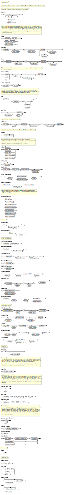
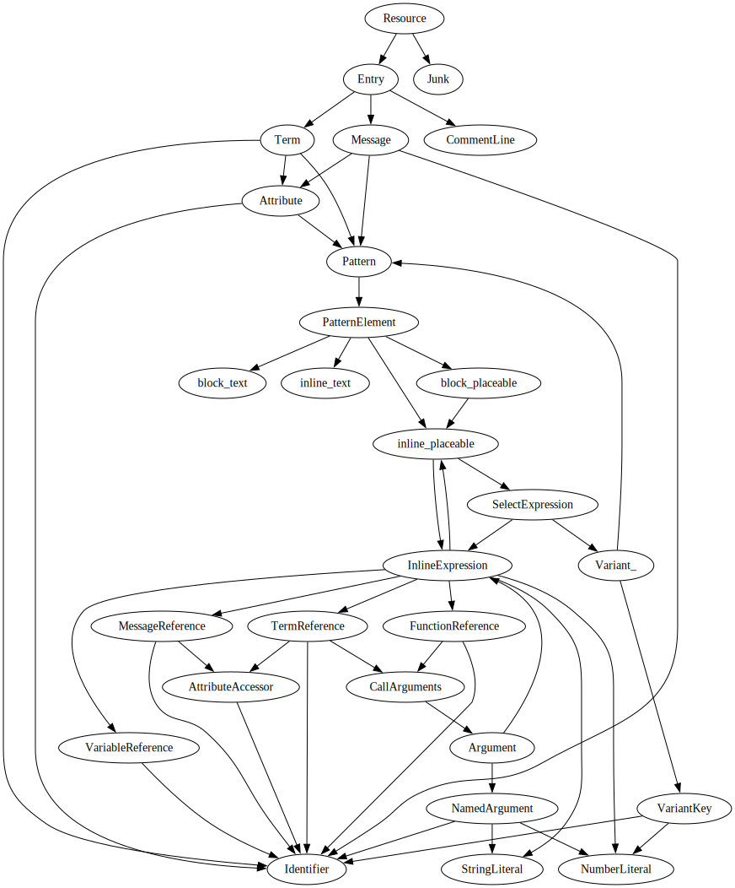

# fluent4rs

[](https://github.com/nigeleke/fluent4rs/blob/master/LICENSE)
[](https://www.rust-lang.org/)
[](https://github.com/nigeleke/fluent4rs/actions/workflows/acceptance.yml)
[](https://codecov.io/gh/nigeleke/fluent4rs)


  [Site](https://nigeleke.github.io/fluent4rs) \| [GitHub](https://github.com/nigeleke/fluent4rs) \| [API](https://docs.rs/fluent4rs/latest/fluent4rs/) \| [Coverage Report](https://app.codecov.io/gh/nigeleke/fluent4rs)

A Fluent (language translation) resource file codec.

## Background

The [fluent-syntax](https://crates.io/crates/fluent_syntax) crate from [Project Fluent](https://projectfluent.org/)
parses [Fluent FTL files](https://projectfluent.org/fluent/guide/). It provides a deserialisation only from the
`Resource` level.

This crate:

* enables conversion in both directions for any node in the syntax tree,
* provides a syntax tree walker.

It has been written for [lingora](https://github.com/nigeleke/lingora) (a localization management program), and may be
found to be useful outside of that context.

From version 2.3+, the underlying parser crate changed from [pom](https://crates.io/crates/pom) to [chumsky](https://crates.io/crates/chumsky)
with a 91% performance improvement. The pom parser remains an option (via `--no-default-features --features=parser-pom`) if
clients need to use it.

It is not intended to replace any aspects of the [fluent-rs](https://github.com/projectfluent/fluent-rs)
crate implemented by [Project Fluent](https://projectfluent.org/), and, for the majority of language
translation needs, the reader is referred back to that crate.

| __Usage__                                        | [fluent4rs](https://nigeleke.github.io/fluent4rs/) | [fluent-syntax](https://crates.io/crates/fluent_syntax) |
| ------------------------------------------------ | -------------------------------------------------- | ------------------------------------------------------- |
| Programmatic inspection & editing of `ftl` files | ✓                                                  | ?                                                       |
| Language translation in a program                | x                                                  | [fluent](https://crates.io/crates/fluent)               |

## Features

| __Feature__    | __Description__                                                     |
|----------------|---------------------------------------------------------------------|
| default        | Default parser_chumskey,walker                                      |
| parser_chumksy | Use the chumksy parser; This feature and pom are mutually exclusive |
| parser_pom     | Use the pom parser; This feature and chumsky are mutually exclusive |
| hash           | Allow AST nodes to be hashed, for potential usages in `HashMap`s    |
| serde          | Allow AST nodes to be serialised / deserialised                     |
| trace          | Include tracing to stderr in the DefaultVisitor implementation      |
| walker         | Provide AST walker and visitors                                     |

## Development

```bash
cargo test
```

## Benchmarking

```bash
cargo bench --no-default-features --features parser-pom --bench parser_bench -- --save-baseline pom
cargo bench --no-default-features --features parser-chumsky --bench parser_bench -- --baseline pom
```

```
parse_full_grammar_example
                        time:   [651.05 µs 652.30 µs 653.57 µs]
                        change: [−91.189% −91.136% −91.070%] (p = 0.00 < 0.05)
                        Performance has improved.
```

## AST Image View




